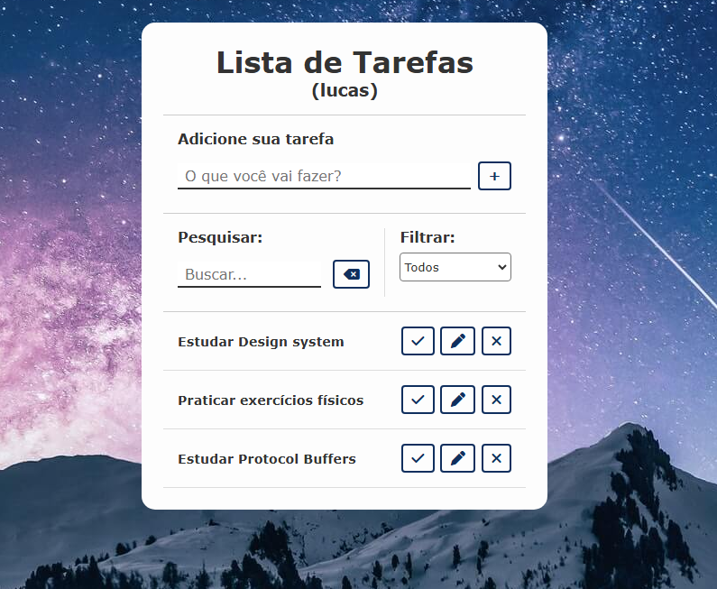
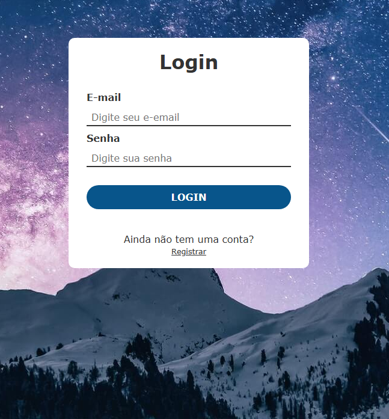

## To Do List

### Visualização

<table>
  <tr>
    <td></td>
  </tr>
  <tr>
    <td></td>
  </tr>
 </table>

### Instalação

```bash
npm i
```

### Tarefas de um futuro próximo

- [ ] Validar senha forte e fraca.
- [ ] Adicionar ícone para visualizar senha.
- [ ] Adicionar testes.
